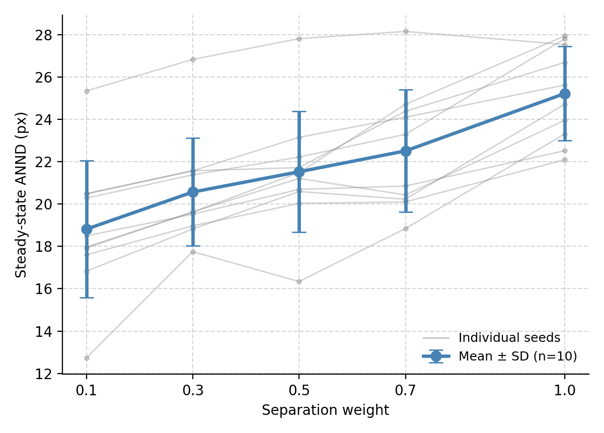

# Flocking & Separation Weight — PCI Group 19

Project for the **Project Collective Intelligence (PCI)** course (BSc AI, VU Amsterdam).
We study how the **separation weight** in a Boids-style flocking model affects flock
cohesion, measured as the **average nearest-neighbour distance (ANND)** across agents.

📄 **Final report:** [`report/PCI_final_report_group19.pdf`](report/PCI_final_report_group19.pdf)



## Overview

The simulation is built on [Violet](https://github.com/m-rots/violet), with 50 agents
following the classic alignment / cohesion / separation rules. We vary the separation
weight over five conditions (0.1, 0.3, 0.5, 0.7, 1.0) and run each condition with the
same 10 seeds. Each run lasts 500 ticks; the first 200 ticks are discarded as a
stabilisation phase and ANND is averaged over the stable phase.

Because the same seeds are reused in every condition (a matched, within-subjects
design), the analysis uses a **repeated-measures ANOVA**, confirmed with a Friedman
test, and paired Wilcoxon pairwise comparisons with Bonferroni correction. ANND
increases monotonically with separation weight (see the report for full results).

## Repository structure

| Path | Description |
|---|---|
| `flocking.py` | Flocking simulation + experiment loop (ANND per condition/seed) |
| `anova_analysis.py` | Statistical analysis: RM-ANOVA, Friedman, paired Wilcoxon, trend regression |
| `plot_seed_spread.py` | Per-seed spread plot of ANND vs. separation weight |
| `make_diagrams.py` | Diagrams used in the presentation slides |
| `figures/` | Generated plots and diagrams |
| `report/` | Final report (PDF) |
| `images/` | Agent sprites used by the simulator |

## Running

Requires Python 3.13+ and [uv](https://docs.astral.sh/uv/):

```sh
uv run flocking.py        # run the simulation experiment
uv run anova_analysis.py  # run the statistical analysis
```

Note: `flocking.py` is currently set to a single seed (`SEEDS = list(range(1))`) for a
quick run; the results in the report were produced with `SEEDS = list(range(10))`.
